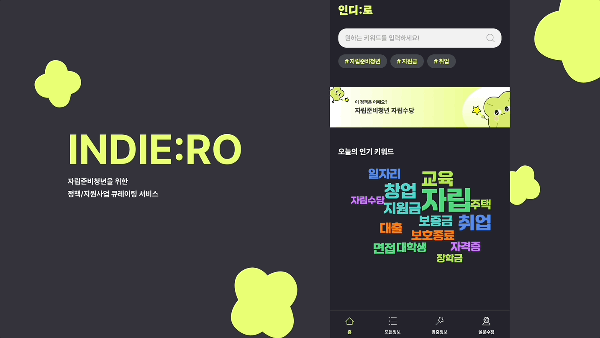
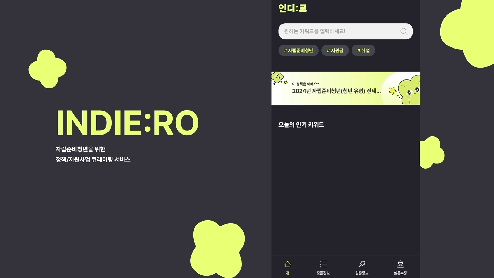
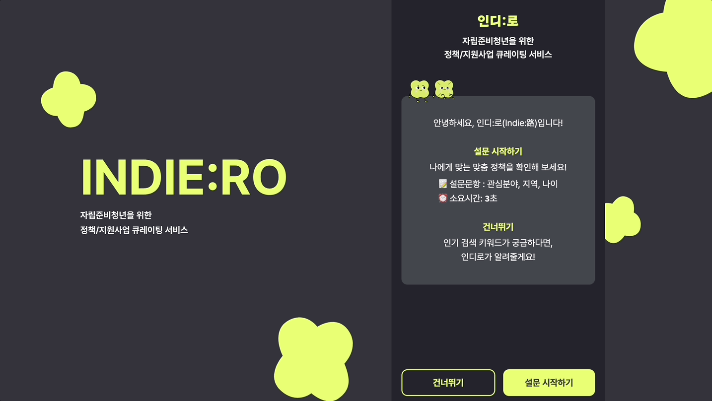
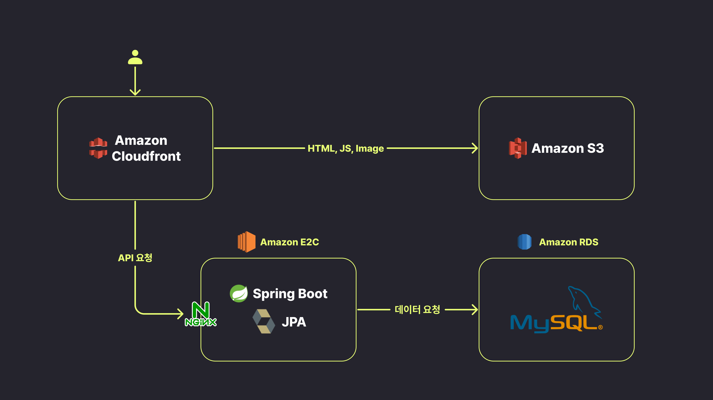
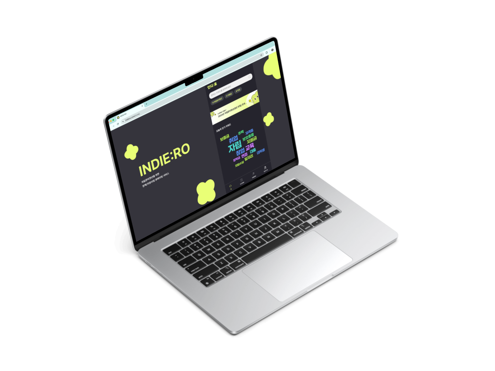

<a href="https://indiero.com" target="_blank">
  

    
  

  

    INDIE:RO 바로가기
  

</a>
<a href="https://youtu.be/OTbPonOCBro?si=46pgq9HaeVRXKO2P" target="_blank">
  

  INDIE:RO 소개영상 보러가기
  

</a>

  자립준비청년들을 위한 관련 정책 및 지원 정보 큐레이팅 서비스

## 프로젝트 소개

**인디로는 자립준비청년들을 위해 맞춤정책 및 지원사업을 추천하는 서비스입니다.**
전국 청년 관련 정책 약 `2000`여 개를 실시간으로 제공하고 정책 간 유사도를 계산하여 사용자가 관심 있어 할 만한 지원 사업 및 정책을 추천합니다.
이를 통해, 청년들이 자신의 상황에 맞는 정보를 쉽게 접근하고, 실질적인 지원을 받을 수 있도록 도움을 주는 것을 목표로 하고 있습니다.

 

## 주요 기능 소개

### 유사도 기반 정책 추천(배너)

### 조회수 기반 인기 키워드 추천(워드클라우드)

### 설문조사를 통한 맞춤정보 조회

## 서버 구성도

## 지원 플랫폼

<table>
  <tr>
    <td align="center">
        
    </td>
    <td align="center">
        
    </td>
  </tr>
  <tr>
    <td align="center">
        PC
    </td>
    <td align="center">
        Mobile
    </td>
  </tr>
</table>

## 기술스택

- CI/CD
  - GitHub Actions
- Frontend
  - React + Typescript
  - TanStack Query
  - Emotion
  - Webpack
  - Storybook
  - Playwright
  - MSW
  - GitHub Actions
  - AWS S3
  - AWS CloudFront
- Backend
  - Spring Boot
  - Spring Data JPA
  - Java
  - MySQL
  - AWS EC2
- Data
  - Python
  - MySQL

## 팀원 소개

|                               [은서](https://github.com/enxxo)                               |                              [솔비](https://github.com/hae-on)                              |                           [혜령](https://github.com/HyeryongChoi)                           |                            [승희](https://github.com/HASEUNGHEEE)                            |
| :------------------------------------------------------------------------------------------: | :-----------------------------------------------------------------------------------------: | :-----------------------------------------------------------------------------------------: | :------------------------------------------------------------------------------------------: |
|  |  |  |  |
|                                             Data                                             |                                          Frontend                                           |                                          Frontend                                           |                                           Backend                                            |

